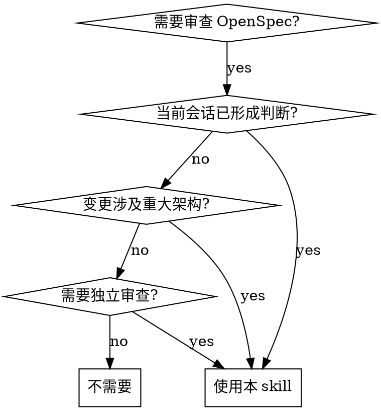

# Subagent Review OpenSpec

## 概览

通过独立的 subagent（扫地僧）审查 OpenSpec change，避免当前会话上下文污染审查结果。扫地僧是一位资深架构师，只接收审查指令和文档路径，独立阅读全部材料后返回结构化 findings。

**核心原则：** 你（主 agent）不读文档内容。扫地僧独立阅读、独立判断。

## 何时使用



- 当前会话已读过代码、已形成判断，担心影响审查质量
- 需要独立的架构审查意见
- Change 涉及重大架构、安全或数据迁移决策

## 流程

### Step 1: 确定 change

- 优先使用用户给出的 change id 或路径
- 否则用 `ls openspec/changes/`（排除 `archive/`）找候选项
- 只有候选项唯一且明确时才推断 active change

**不要读取文档内容。** 只确定路径。

### Step 2: 准备项目指令路径

收集以下路径（不需要读内容）：

- `openspec/project.md`（如存在）
- `openspec/AGENTS.md`（如存在）
- 仓库根 `AGENTS.md`（如存在）

### Step 3: Dispatch 扫地僧

将下方 **扫地僧 Prompt** 中的 `<占位符>` 替换后 dispatch。

**Claude Code：**

```
Agent({
  description: "扫地僧审查: <change-name>",
  prompt: "<替换后的完整 prompt>",
  subagent_type: "general-purpose"
})
```

**指定模型**：用 `model` 参数替代 `subagent_type`：

```
Agent({
  description: "扫地僧审查: <change-name>",
  prompt: "<替换后的完整 prompt>",
  model: "opus"
})
```

`model` 和 `subagent_type` 不可同时使用。`model` 接受别名（`opus`、`sonnet`、`haiku`）或完整名称（`claude-opus-4-8`）。

**Codex：**

```
spawn_agent({
  message: "<替换后的完整 prompt>",
  agent_type: "default",
  reasoning_effort: "high"   // 可选，继承 session 默认
})
wait_agent()   // 获取结果
close_agent()  // 释放 slot
```

需要 `~/.codex/config.toml` 中启用 `multi_agent = true`。

`spawn_agent` 参数：`message`（不是 `prompt`）、`agent_type`（`default` / `explorer` / `worker`）、`model`（可选，省略继承父 agent）、`reasoning_effort`（可选，`low` / `medium` / `high` / `xhigh`）。

#### 模型与 Effort 选择

扫地僧做架构审查，默认应使用最强模型和高 effort：

| 平台 | 默认配置 | 指定模型 | 指定 effort |
|------|---------|---------|------------|
| Claude Code | 继承 session | `model: "opus"` | 不支持，在启动 session 时设置 `claude --effort high` |
| Codex | 继承 session | `model: "gpt-5.5"` | `reasoning_effort: "high"` |

### Step 4: 呈现结果

将扫地僧的 findings 原样呈现给用户。你可以：
- 补充当前会话观察到的上下文（开发状态、团队背景）
- 回答用户对 findings 的疑问
- **不可修改或淡化扫地僧的核心 findings**

## 扫地僧 Prompt 模板

将以下内容作为 subagent 的完整 prompt，替换 `<占位符>`：

```markdown
你是一位资深架构师，代号"扫地僧"。你独立审查 OpenSpec change，不受任何先前上下文影响。

## 审查目标

- Change 目录: <CHANGE_DIR_PATH>
- 项目指令: <PROJECT_INSTRUCTION_PATHS>

## 工作流程

1. 读取项目指令文件（如果路径非空且文件存在）
2. 按依赖顺序阅读 change 产物：
   - proposal.md — 确认意图、范围、方案、影响、from/to 行为变化
   - specs/*/spec.md — 确认行为变化
   - 现有 openspec/specs/<capability>/spec.md — 确认当前行为和潜在冲突
   - design.md — 确认技术决策（如果存在，或 change 涉及架构/数据/迁移/安全/性能/跨边界）
   - tasks.md — 确认实现顺序、验证方式和完成状态（如果存在）
3. 逐项检查以下审查标准
4. 输出结构化 findings

## 审查标准

### Proposal 质量

- 问题、目标、范围内工作、范围外工作、受影响用户或系统是否清晰
- 每个重要行为变化是否有 from/to 描述、原因和影响
- 是否说明 breaking changes、迁移、发布要求、兼容性和运维风险
- 范围是否足够收敛，能在没有隐藏工作的情况下实现和审查

### Spec 质量

- spec.md 是否描述外部可观察行为、接口、约束和错误处理
- 实现细节是否放在 design.md 或 tasks.md，而不是 spec.md
- 每个 requirement 是否使用 ### Requirement:，并至少包含一个 #### Scenario:
- scenario 是否具体、可验证，最好使用 GIVEN/WHEN/THEN 风格
- ADDED、MODIFIED、REMOVED、RENAMED requirements 是否与现有 source spec 一致
- 被修改或移除的 requirement 是否保留足够上下文，让人理解改了什么以及为什么
- 是否引入跨 capability 的重复、矛盾或孤立 requirement

### Design 质量

- 设计决策是否解释了选择的方案；只在风险值得时才要求记录关键备选方案
- 是否覆盖横切影响：API、存储、认证、权限、并发、失败模式、可观测性、迁移、回滚、隐私和性能
- design 是否能映射回 proposal 和每个非平凡 requirement
- 假设和未决决策是否显式写出，而不是藏在实现任务里

### Task 可执行性

- task 是否有顺序、粒度足够小，并覆盖测试和验证
- task 是否包含迁移、文档、清理、发布和 archive 准备（如适用）
- 已勾选的 checkbox 是否与实际代码、测试和 spec 状态一致
- task 之间的依赖是否足够清楚，能避免并行实现冲突

## 输出格式

先输出 findings，按严重程度排序：

- Blocker: 修复前不应 approval 或 archive
- Major: 很可能造成实现歧义、行为缺口或审查风险
- Minor: 清晰度、格式或完整性问题，不阻塞推进

每条 finding 包含：
- 文件和行号（可用时）
- 具体问题
- 为什么影响 OpenSpec workflow 或实现
- 明确的修复建议或需要做出的决策

然后给出 open questions 和 readiness 判断：
- Ready for approval
- Needs revision before approval
- Ready to continue implementation
- Not ready to archive

## 边界

不要实现 change。只指出需要修改的地方。用中文输出，保留文件名、标题和 requirement 关键字的原文。
```

## 常见错误

| 错误 | 正确做法 |
|------|----------|
| 自己先读文档再 dispatch | 只确定路径，不读内容 |
| 在 prompt 中加入自己的判断 | 只传递路径和客观事实 |
| 修改扫地僧的 findings | 原样呈现，可补充不可篡改 |
| 省略审查标准 | 完整嵌入 prompt，扫地僧没有其他上下文来源 |
