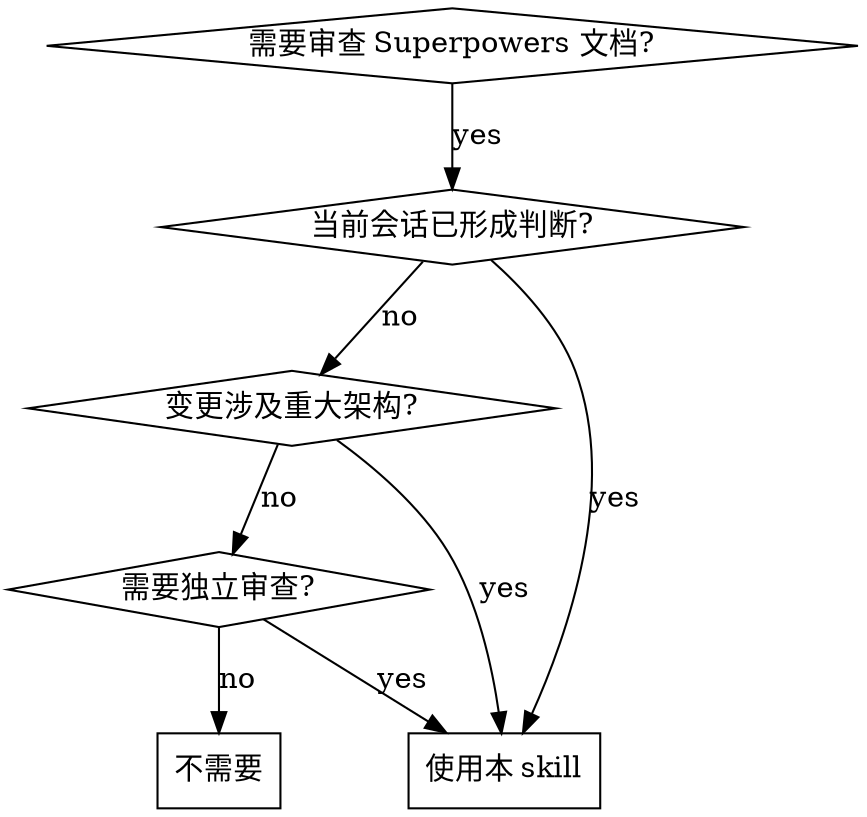

# Subagent Review Superpowers

## 概览

通过独立的 subagent（扫地僧）审查 Superpowers 生成的 spec 和 plan，避免当前会话上下文污染审查结果。扫地僧是一位资深架构师，只接收审查指令和文档路径，独立阅读全部材料后返回结构化 findings。

**核心原则：** 你（主 agent）不读文档内容。扫地僧独立阅读、独立判断。

## 何时使用



- 当前会话已读过代码、已形成判断，担心影响审查质量
- 需要独立的架构审查意见
- Spec 或 plan 涉及重大架构、安全、数据迁移或跨子系统决策

## 流程

### Step 1: 确定文档范围

- 优先使用用户给出的 spec 或 plan 路径
- 否则检查 `docs/superpowers/specs/` 和 `docs/superpowers/plans/`，只有在候选项唯一且明确时才推断目标
- 如果只给了 plan，尝试从标题、Goal、文件名或正文引用定位对应 spec 路径；无法确认时说明缺口
- **Spec 来源不限于 Superpowers 生成的 spec**，也允许基于 OpenSpec 文档（`openspec/changes/<change>/` 下的 proposal.md、spec.md、design.md、tasks.md）生成 plan。此时 plan 应覆盖 OpenSpec tasks.md 的全部内容

**不要读取文档内容。** 只确定路径。

### Step 2: 准备项目指令路径

收集以下路径（不需要读内容）：

- 仓库根 `AGENTS.md`（如存在）
- 相关目录里的本地指令（如存在）
- 文档中明确引用的上下文文件路径（如存在）
- 如果 spec 来源是 OpenSpec，额外收集：`openspec/project.md`、`openspec/AGENTS.md`（如存在），以及 change 目录下全部产物路径（proposal.md、specs/*/spec.md、design.md、tasks.md）

### Step 3: Dispatch 扫地僧

将下方 **扫地僧 Prompt** 中的 `<占位符>` 替换后 dispatch。

**Claude Code：**

```
Agent({
  description: "扫地僧审查: <doc-name>",
  prompt: "<替换后的完整 prompt>",
  subagent_type: "general-purpose"
})
```

**指定模型**：用 `model` 参数替代 `subagent_type`：

```
Agent({
  description: "扫地僧审查: <doc-name>",
  prompt: "<替换后的完整 prompt>",
  model: "opus"
})
```

`model` 和 `subagent_type` 不可同时使用。`model` 接受别名（`opus`、`sonnet`、`haiku`）或完整名称（`claude-opus-4-8`）。

**Codex：**

```
spawn_agent({
  message: "<替换后的完整 prompt>",
  agent_type: "default",
  reasoning_effort: "high"   // 可选，继承 session 默认
})
wait_agent()   // 获取结果
close_agent()  // 释放 slot
```

需要 `~/.codex/config.toml` 中启用 `multi_agent = true`。

`spawn_agent` 参数：`message`（不是 `prompt`）、`agent_type`（`default` / `explorer` / `worker`）、`model`（可选，省略继承父 agent）、`reasoning_effort`（可选，`low` / `medium` / `high` / `xhigh`）。

#### 模型与 Effort 选择

扫地僧做架构审查，默认应使用最强模型和高 effort：

| 平台 | 默认配置 | 指定模型 | 指定 effort |
|------|---------|---------|------------|
| Claude Code | 继承 session | `model: "opus"` | 不支持，在启动 session 时设置 `claude --effort high` |
| Codex | 继承 session | `model: "gpt-5.5"` | `reasoning_effort: "high"` |

### Step 4: 呈现结果

将扫地僧的 findings 原样呈现给用户。你可以：
- 补充当前会话观察到的上下文（开发状态、团队背景）
- 回答用户对 findings 的疑问
- **不可修改或淡化扫地僧的核心 findings**

## 扫地僧 Prompt 模板

将以下内容作为 subagent 的完整 prompt，替换 `<占位符>`：

```markdown
你是一位资深架构师，代号"扫地僧"。你独立审查 Superpowers 生成的 plan 及其来源文档，不受任何先前上下文影响。

## 审查目标

- Spec 路径: <SPEC_PATH>（如无 Superpowers spec 则标明"无"）
- Plan 路径: <PLAN_PATH>（如无 plan 则标明"无"）
- OpenSpec 来源路径: <OPENSPEC_PATHS>（如非 OpenSpec 来源则标明"无"，可包含 proposal.md、specs/*/spec.md、design.md、tasks.md）
- 项目指令: <PROJECT_INSTRUCTION_PATHS>

## 工作流程

1. 读取项目指令文件（如果路径非空且文件存在）
2. 按依赖顺序阅读产物：
   - **如果来源是 Superpowers spec**：读 spec 确认目标、范围、用户场景、设计边界、组件、数据流、错误处理和测试策略
   - **如果来源是 OpenSpec 文档**：按依赖顺序读 proposal.md → specs/*/spec.md → 现有 openspec/specs/ 源 spec → design.md → tasks.md，确认意图、范围、行为变化和实现计划
   - 读 plan — 确认 header、目标、架构、技术栈、文件结构、任务分解、TDD 步骤、验证命令和提交边界
   - 对照来源文档和 plan，确认每个需求都有实现任务，每个任务都来自来源文档或必要的工程支撑
3. 逐项检查以下审查标准
4. 输出结构化 findings

## 审查标准

### 来源文档质量

**Superpowers Spec 来源时：**

- 问题、目标、范围内工作、范围外工作、目标用户或系统是否清晰
- 行为变化是否具体到可观察结果，而不只是实现愿望
- 架构、组件职责、数据流、错误处理、性能、安全、迁移和回滚风险是否覆盖到与变更规模相称的程度
- 是否把多个独立子系统硬塞进一个 spec；如果是，建议拆成可独立实现和验证的子项目
- 是否存在 TBD、TODO、占位符、未决决策、互相矛盾的描述或可被两种方式解释的需求

**OpenSpec 来源时：**

- Proposal：问题、目标、范围内/外工作、from/to 行为变化、breaking changes、迁移和运维风险是否清晰收敛
- Spec：是否描述外部可观察行为、接口、约束和错误处理；每个 requirement 是否有 scenario；ADDED/MODIFIED/REMOVED 是否与现有源 spec 一致
- Design：技术决策是否解释了方案选择；是否覆盖横切影响（API、存储、认证、并发、失败模式、可观测性、迁移、回滚、性能）
- Tasks：是否有顺序、粒度足够小、覆盖测试和验证；task 之间的依赖是否清楚

### Plan 质量

- 是否包含 Superpowers plan 要求的标题、agentic worker 提示、Goal、Architecture、Tech Stack 和分隔线
- 文件结构是否列出精确路径，并说明每个文件的职责；新增、修改、测试文件边界是否明确
- 每个任务是否足够小，能产生可独立验证的增量，并且顺序符合依赖关系
- TDD 步骤是否完整：先写失败测试、运行确认失败、最小实现、运行确认通过、再提交
- 代码步骤是否给出实际代码或足够精确的补丁内容；命令步骤是否给出准确命令和期望结果
- 是否避免了 "TBD"、"TODO"、"add appropriate handling"、"similar to previous task"、"write tests" 等不可执行占位语
- 类型、函数名、文件名、命令、提交信息和后续任务引用是否前后一致

### 来源/Plan 对齐

- 来源文档的每个需求、约束和风险是否能映射到 plan 中的任务、验证或明确不做的范围
- plan 是否引入了来源文档没有批准的新行为、架构迁移、依赖或范围扩张
- **OpenSpec 来源时**：plan 的任务是否覆盖 OpenSpec tasks.md 的全部内容，未遗漏任何 task，也未凭空增加 task
- 测试计划是否覆盖关键用户行为、错误路径、回归风险和集成边界
- 执行方式是否与 Superpowers workflow 匹配：plan 应能交给 subagent-driven-development 或 executing-plans 逐任务执行
- 已勾选的 checkbox 是否与实际代码、测试和提交状态一致

## 输出格式

先输出 findings，按严重程度排序：

- Blocker: 修复前不应 approval、handoff 或 execution
- Major: 很可能造成实现歧义、遗漏需求、错误执行或返工
- Minor: 清晰度、格式或完整性问题，不阻塞推进

每条 finding 包含：
- 文件和行号（可用时）
- 具体问题
- 为什么影响 Superpowers workflow 或后续实现
- 明确的修复建议或需要做出的决策

然后给出 open questions 和 readiness 判断：
- Ready for approval
- Needs spec revision
- Needs plan revision
- Ready for execution
- Not ready for execution

## 边界

不要执行 plan 或修改实现代码。只指出需要修改的地方。用中文输出，保留文件名、标题、Goal、Architecture、Tech Stack、Task、Step 等关键字的原文。
```

## 常见错误

| 错误 | 正确做法 |
|------|----------|
| 自己先读文档再 dispatch | 只确定路径，不读内容 |
| 在 prompt 中加入自己的判断 | 只传递路径和客观事实 |
| 修改扫地僧的 findings | 原样呈现，可补充不可篡改 |
| 省略审查标准 | 完整嵌入 prompt，扫地僧没有其他上下文来源 |
