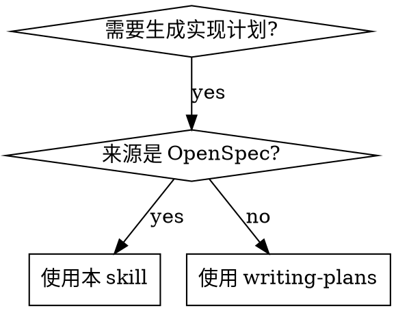

# Write Plan from OpenSpec

## 概览

从 OpenSpec change 文档生成 Superpowers plan。Plan 是唯一产出物——不生成 Superpowers spec。

**核心原则：** OpenSpec 是 spec 源头，Superpowers plan 是执行契约。Plan 必须覆盖 OpenSpec tasks.md 的全部内容，未遗漏任何 task，也未凭空增加 task。

## 何时使用



- 用户要求基于 OpenSpec change 生成 Superpowers plan
- 已有 OpenSpec change 文档（proposal、specs、design、tasks），需要转化为可执行计划

**不适用：** 来源是 Superpowers spec 或其他非 OpenSpec 文档时，使用 `superpowers:writing-plans`。

## 流程

### Step 1: 确定 OpenSpec Change

- 优先使用用户给出的 change id 或路径
- 否则用 `ls openspec/changes/`（排除 `archive/`）找候选项
- 多个活跃 change 时，列出候选项让用户选择，**不可自行推断**
- 只有候选项唯一且明确时才自动采用

### Step 2: 阅读来源文档

读取项目指令和 OpenSpec 产物。

项目指令（如存在）：
- `openspec/project.md`
- `openspec/AGENTS.md`
- 仓库根 `AGENTS.md`
- 受影响目录里的本地指令

按依赖顺序读 OpenSpec 产物：
1. `proposal.md` — 确认意图、范围、方案、影响、from/to 行为变化
2. `specs/*/spec.md` — 确认 requirements 和 scenarios
3. 现有 `openspec/specs/<capability>/spec.md` — 确认当前行为和潜在冲突
4. `design.md`（如存在）— 确认技术决策
5. `tasks.md` — 确认实现顺序和任务列表（**必需**，见下方检查）

### Step 2.5: 完整性检查

如果 tasks.md 不存在，OpenSpec 文档不完整。**停止生成 plan**，告知用户缺少 tasks.md，等待用户补全后再继续。不可在没有 tasks.md 的情况下自行推导任务。

如发现 OpenSpec 文档间存在疑议或冲突（如 proposal 与 design 矛盾、specs 覆盖不全），**不可自行修改 OpenSpec 文档**。将问题列出，交由用户决策，按用户决定执行。

### Step 3: 生成 Plan

按照 `superpowers:writing-plans` 的格式生成 plan 文档。**不生成 Superpowers spec，不修改 OpenSpec 文档。**

Plan header 格式：

```markdown
# [Feature Name] Implementation Plan

**Goal:** [从 proposal.md 的目标和范围提炼，一句话]

**Architecture:** [从 design.md 的技术决策提炼，2-3 句]

**Tech Stack:** [从 design.md 和现有代码推断]

**Spec Source:** OpenSpec change `<change-id>` — `openspec/changes/<change-id>/`

---
```

#### OpenSpec 到 Plan 的映射规则

| OpenSpec 产物 | Plan 中的对应 |
|---------------|--------------|
| proposal.md 问题/目标 | Goal |
| proposal.md 范围内/外 | 隐含在 task 范围中 |
| proposal.md from/to 行为变化 | 验证测试的断言依据 |
| specs/*/spec.md requirements | 每个 requirement → 至少一个 task |
| specs/*/spec.md scenarios | 验证测试的 GIVEN/WHEN/THEN |
| design.md 技术决策 | Architecture + 实现细节 |
| design.md 横切影响 | 对应的集成/错误处理 task |
| tasks.md 任务 | 每个 task → 一个或多个 plan task，可细化粒度 |

#### Tasks.md 覆盖规则

- Plan 的任务必须覆盖 OpenSpec tasks.md 中的每个 task，不允许遗漏
- Plan 允许比 tasks.md 更细粒度：一个 tasks.md task 可以拆成多个 plan task（如拆出测试、集成、边界处理），但每个 plan task 都必须能映射回某个 tasks.md task 或必要的工程支撑
- 不凭空增加 task：plan task 必须来自 OpenSpec 内容或必要的工程支撑（测试脚手架、构建配置等）

#### Task 粒度与格式

遵循 `superpowers:writing-plans` 的规范：
- 每个步骤是一个动作（2-5 分钟）
- TDD 步骤：写失败测试 → 确认失败 → 最小实现 → 确认通过 → 提交
- 每个步骤包含实际代码或精确命令，不允许占位符
- 精确文件路径，说明新增/修改/测试文件

### Step 4: 自查

生成 plan 后执行以下检查：

1. **Tasks.md 覆盖度**：逐条对照 OpenSpec tasks.md，确认每个 task 都有对应 plan task 覆盖，无遗漏；确认每个 plan task 都能映射回 tasks.md 或工程支撑，无凭空增加
2. **Requirement 覆盖度**：每个 OpenSpec requirement 都能映射到 plan task
3. **占位符扫描**：搜索 TBD、TODO、implement later、add appropriate handling、similar to previous task 等，全部替换为实际内容
4. **一致性检查**：类型、函数名、文件路径、命令在 plan 中前后一致

### Step 5: 保存

保存到 `docs/superpowers/plans/YYYY-MM-DD-<feature-name>.md`（用户偏好优先）。

## 常见错误

| 错误 | 正确做法 |
|------|----------|
| 同时生成 Superpowers spec 和 plan | 只生成 plan，OpenSpec 已经是 spec |
| 多个活跃 change 时自行选一个 | 列出候选项让用户确认 |
| Plan task 不覆盖 tasks.md 的某些 task | 逐条对照，确保全部覆盖 |
| Plan 凭空增加 tasks.md 没有的任务 | 只允许来自 OpenSpec 或工程支撑的任务 |
| 在 plan 中引用 Superpowers spec 路径 | 引用 OpenSpec change 路径作为 spec source |
| 省略 proposal.md 的 from/to 行为变化 | 用作验证测试的断言依据 |
| tasks.md 不存在时自行推导任务 | 停止，告知用户补全，等待后再继续 |
| 发现冲突时自行修改 OpenSpec 文档 | 列出疑议，交由用户决策 |

## 输出语言

默认用中文输出。当用户使用中文提问时用中文。若用户指明了其他语言，遵循用户指定的语言。保留文件名、标题、Goal、Architecture、Tech Stack、Task、Step 等关键字原文。
